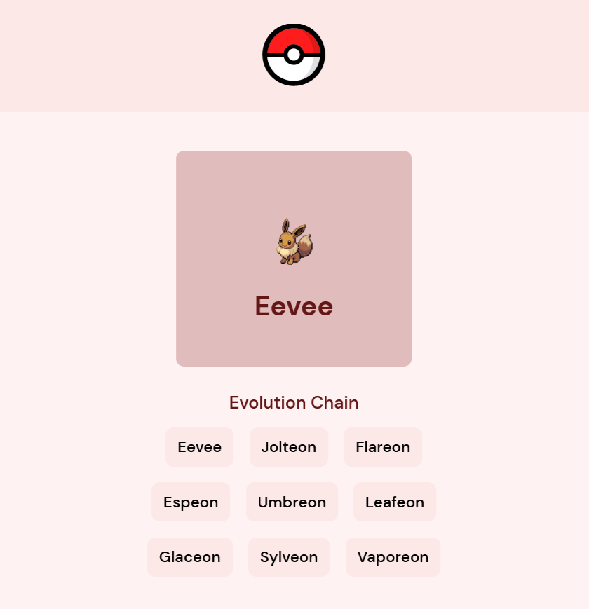

# Choose your Pokémon! 

> Aplicativo criado para um processo seletivo onde é possível selecionar um Pokémon, verificar sua cadeia de evolução e algumas de suas informações 

### Ajustes e melhorias

Projeto concluído!

- [x] Desenvolvimento de todo o projeto em SPA utilizando Vue e Pinia 
- [x] Páginas responsivas
- [x] Consumo de REST API 

## 💻 Pré-requisitos

Antes de começar, verifique se você atendeu aos seguintes requisitos:

* Você instalou a versão mais recente de `Node.js`

## 🚀 Instalando Choose your Pokémon

Para instalar o Choose your Pokémon, siga estas etapas:

* Clone esse repositório com `git clone https://github.com/gguilhermelopes/pokedex`
* Entre na pasta com `cd pokedex`
* Instale as dependências com `npm install`

## ☕ Usando Choose your Pokémon

Para usar Choose your Pokémon, siga estas etapas:

* Certifique-se de que todas as dependências foram instaladas e que esteja na pasta do projeto. Utilize `npm start`
